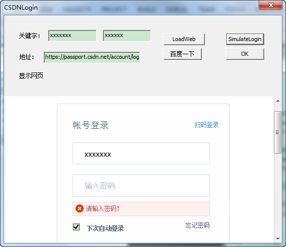

C++ 操作IE网页，模拟点击，模拟输入


##### 代码来自

c++内嵌IWebBrowser2功能整理

https://blog.csdn.net/nanjun520/article/details/53024503


##### MSDN

https://docs.microsoft.com/en-us/previous-versions/windows/internet-explorer/ie-developer/platform-apis/bb508508(v=vs.85)

https://docs.microsoft.com/en-us/previous-versions/windows/internet-explorer/ie-developer/platform-apis/aa768280(v=vs.85)


#### C++和JS互调

IWebbrowser2中C++与JavaScript的交互调用
https://blog.csdn.net/mfcing/article/details/44540683

#### 封装接口

1、通过ID查找HTML的element。

```
<input name="password" tabindex="2" class="pass-word" id="password" type="password" placeholder="输入密码" value="" autocomplete="off">
```

```cpp

/*
参数1：IE的IWebBrowser2指针
参数2：HTML的element控件ID

返回值：必须手动Release

*/

IHTMLElement * GetHTMLElementByIdOrName(IWebBrowser2* m_piWebBrowser, std::wstring idorName)
{
	IHTMLElement *retElement = 0;
	IDispatch *dispatch = 0;
	HRESULT hr = m_piWebBrowser->get_Document(&dispatch);
	if ((S_OK == hr) && (0 != dispatch))
	{
		IHTMLDocument2 *doc;
		dispatch->QueryInterface(IID_IHTMLDocument2, (void**)&doc);
		dispatch->Release();
		IHTMLElementCollection* doc_all;
		hr = doc->get_all(&doc_all);      // this is like doing document.all
		if (S_OK == hr)
		{
			VARIANT vKey;
			vKey.vt = VT_BSTR;
			vKey.bstrVal = SysAllocString(idorName.c_str());
			VARIANT vIndex;
			VariantInit(&vIndex);
			hr = doc_all->item(vKey, vIndex, &dispatch);       // this is like doing document.all["messages"]
			//清理
			SysFreeString(vKey.bstrVal);
			VariantClear(&vKey);
			VariantClear(&vIndex);
			if ((S_OK == hr) && (0 != dispatch))
			{
				hr = dispatch->QueryInterface(IID_IHTMLElement, (void **)&retElement); // it's the caller's responsibility to release 
				if (S_OK == hr)
				{
				}
				else
				{
					retElement = 0;
				}
				dispatch->Release();
			}
			doc_all->Release();
		}
		doc->Release();
	}
	return retElement;
}
```


2、通过控件的ID，属性和属性值查找HTML的element。

```
<input tabindex="6" class="logging" accesskey="l" type="button" value="登 录">
```

```cpp
/*
参数1: HTML控件名字
参数2：属性名字
参数3：属性值

GetHTMLElementByTag(L"input", L"value", L"登 录");

*/

IHTMLElement * WebAutoLogin::GetHTMLElementByTag(std::wstring tagName, std::wstring PropertyName,
	std::wstring macthValue)
{
	IHTMLElement *retElement = 0;
	IDispatch *dispatch = 0;
	HRESULT hr = m_piWebBrowser->get_Document(&dispatch);
	if ((S_OK == hr) && (0 != dispatch))
	{
		IHTMLDocument2 *doc;
		dispatch->QueryInterface(IID_IHTMLDocument2, (void**)&doc);
		dispatch->Release();
		IHTMLElementCollection* doc_all;
		hr = doc->get_all(&doc_all);      // this is like doing document.all
		if (S_OK == hr)
		{
			VARIANT vKey;
			vKey.vt = VT_BSTR;
			vKey.bstrVal = SysAllocString(tagName.c_str());
			VARIANT vIndex;
			VariantInit(&vIndex);
			hr = doc_all->tags(vKey, &dispatch);       // this is like doing document.all["messages"]
			//清理
			SysFreeString(vKey.bstrVal);
			VariantClear(&vKey);
			VariantClear(&vIndex);
			if ((S_OK == hr) && (0 != dispatch))
			{
				CComQIPtr< IHTMLElementCollection > all_tags = dispatch;
				//hr = dispatch->QueryInterface(IHTMLElementCollection,(void **)&all_tags); // it's the caller's responsibility to release 
				if (S_OK == hr)
				{
					long nTagsCount = 0; //
					hr = all_tags->get_length(&nTagsCount);
					if (FAILED(hr))
					{
						return retElement;
					}

					for (long i = 0; i < nTagsCount; i++)
					{
						CComDispatchDriver spInputElement; //取得第 i 项
						hr = all_tags->item(CComVariant(i), CComVariant(i), &spInputElement);

						if (FAILED(hr))
							continue;
						CComVariant vValue;
						hr = spInputElement.GetPropertyByName(PropertyName.c_str(), &vValue);
						if (VT_EMPTY != vValue.vt)
						{
							LPCTSTR lpValue = vValue.bstrVal ?
								OLE2CT(vValue.bstrVal) : NULL;
							if (NULL == lpValue)
								continue;
							std::wstring cs = (LPCTSTR)lpValue;
							if (0 == _tcscmp(cs.c_str(), macthValue.c_str()))
							{
								hr = spInputElement->QueryInterface(IID_IHTMLElement, (void **)&retElement);
								if (S_OK == hr)
								{
								}
								else
								{
									retElement = 0;
								}
								break;
							}
						}
					}
				}
				else
				{
					retElement = 0;
				}
				dispatch->Release();
			}
			doc_all->Release();
		}
		doc->Release();
	}
	return retElement;
}
```
if用的比较多，可以自己优化掉。


#### 例子介绍
- 模拟百度搜索
<p align="center">

</p>


- 模拟CSDN登录
<p align="center">

</p>


