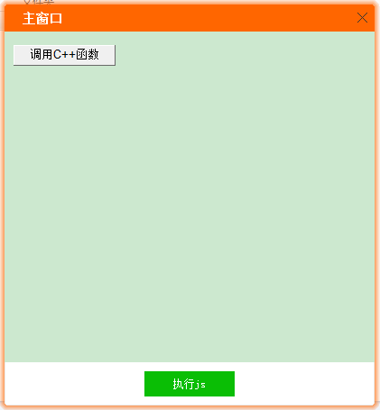

##### js function

```js
    <script language="javascript">  
        function CallCppFunSub(x,y)  
        {
			var num = window.external.g_FunSub(x,y); 
			alert(num);
			return num
        } 
		function JsFunSub(x,y)  
        {
			var num = x - y;
			alert(num);
			return num
        }
    </script> 
```

##### C++ Call js

```cpp
	// C++调用js方法，示例
	// 注意参数顺序，反向
	VARIANT arg[2] = { CComVariant(7),CComVariant(3)};//JsFunSub(3,7)
	VARIANT varRet;
	m_pBrowser->InvokeMethod(m_pBrowser->GetHtmlWindow(),_T("JsFunSub"),&varRet,arg,2);
	int nResult =  varRet.intVal;//-4
```

##### snatshot
