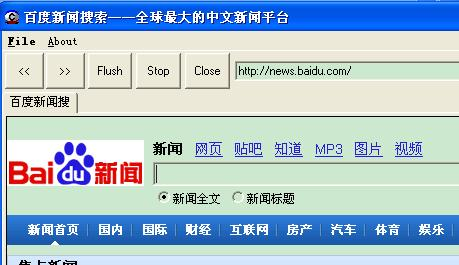

##### 纯C实现多页面山寨浏览器（KsBinExplorer）

by weolar https://bbs.pediy.com/thread-88967-1.htm


Demo效果图




完全的IE内核，IWebBrowser2封装，可以多标签，支持IE下载文件，新窗口自动在程序中弹出。

----


#### 编译说明

直接打开VC6工程文件就可以编译，项目工程中就一个.c文件，其它的文件
通过以下方式包含

```c
#include "TabCtrl.cpp"
// ...
#include "CHTMLTabCtrl.cpp"
```


#### 多标签 TabCtrl.h TabCtrl.c

主程序和多标签的实现参考资料：
[Win32 SDK C Tab Control Made Easy](
https://www.codeproject.com/Articles/14712/Win-SDK-C-Tab-Control-Made-Easy)

#### CWebControl

IDocHostUIHandler，IOleClientSite，IOleInPlaceSite接口的C接口

提供核心打开网页接口

```c
DisplayHTMLPage(hWnd, L"http://news.baidu.com");
```

#### CHTMLTabCtrl 模拟TabCtrl实现的控件

每个CHTMLTabCtrl都是对立的窗体 ，有自己的消息循环。
```c
static VOID CHtmlTabPageMessageLoop (HWND hwnd)
```

####  修改说明

- 替换#include "xxx.cpp"文件为#include "xxx.c"文件

- 实现切换标签功能

点击tab可以切，点击单签tab关闭。

```c
// 当前激活的tab，判断是否可以关闭窗口
static HWND g_ActiveTabHwnd = 0;
```

- 屏蔽js错误提示窗体。

```c
	// ignore js error
	pBrowserApp->lpVtbl->put_Silent(pBrowserApp,VARIANT_TRUE);
```

#### 地址栏editor控件消息回调

```c
// 注册回调函数
hWndEdit=GetDlgItem( hwnd,IDC_EDIT_URL );

wpFormMain_OrigEditProc = (WNDPROC) SetWindowLong(hWndEdit,GWL_WNDPROC,(LONG) FormMain_EditProc);

// 回调函数
// URl框的消息函数，子类化出来接受回车键
LRESULT CALLBACK FormMain_EditProc(HWND hWnd,UINT uMsg,WPARAM wParam,LPARAM lParam)
{
    //这里就是一直希望可以自己处理的WM_CHAR消息了，0-9和BackSpace键放行
    if (uMsg==WM_CHAR)
    {
        if( 0xd ==wParam )
        {
			cmdClickRunUrl_Click (g_frmMain);
        }
		
    }
    //调用原来的默认消息处理函数，和DefWindowProc意思一样
    return CallWindowProc(wpFormMain_OrigEditProc, hWnd, uMsg,wParam, lParam); 
}
```

#### 菜单栏按钮

```cpp
		case IDC_BUTTON_GOFORWARD:
		case IDC_BUTTON_GOBACK:
		case IDC_BUTTON_FLUSH:
		case IDC_BUTTON_STOP:
			cmdClickWeb_DoAction( hwnd, id );
		break;
```


